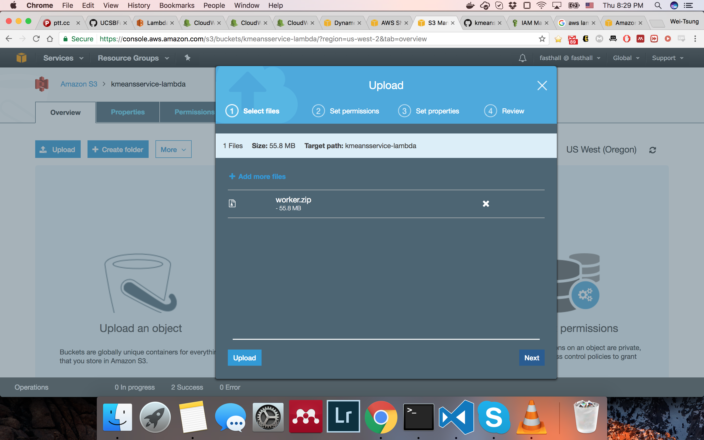
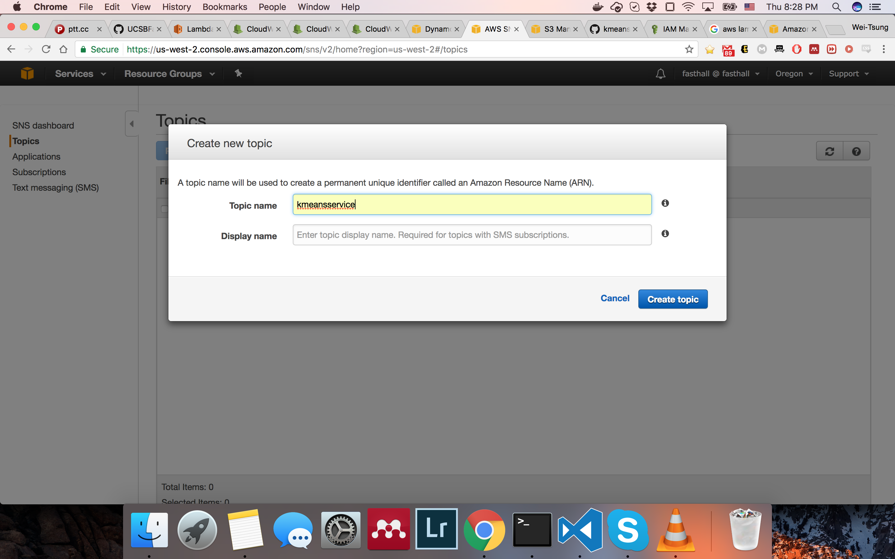
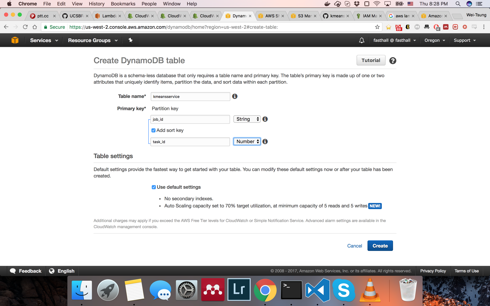
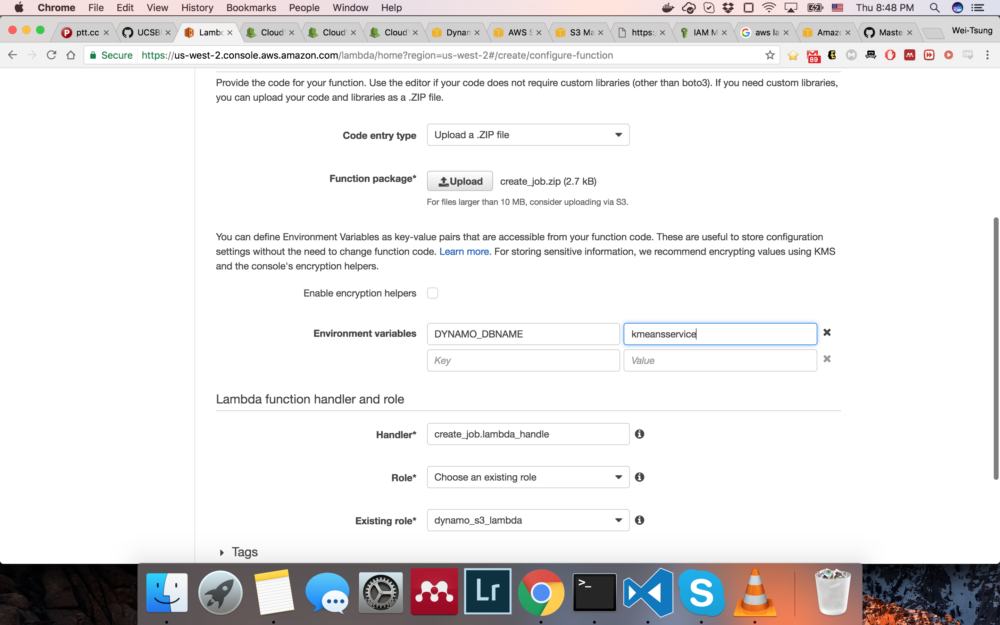
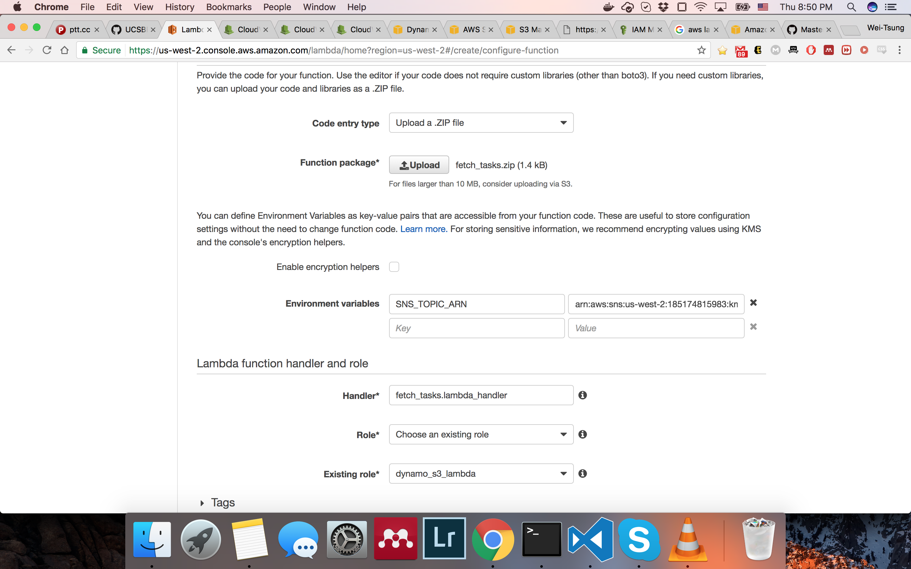
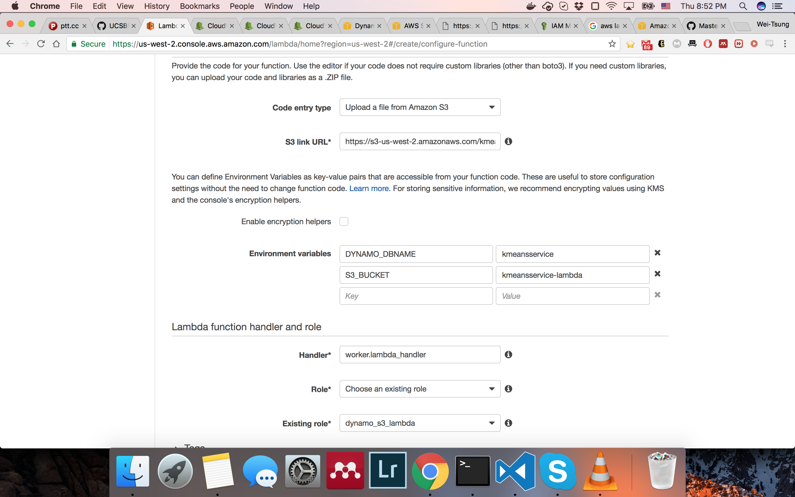
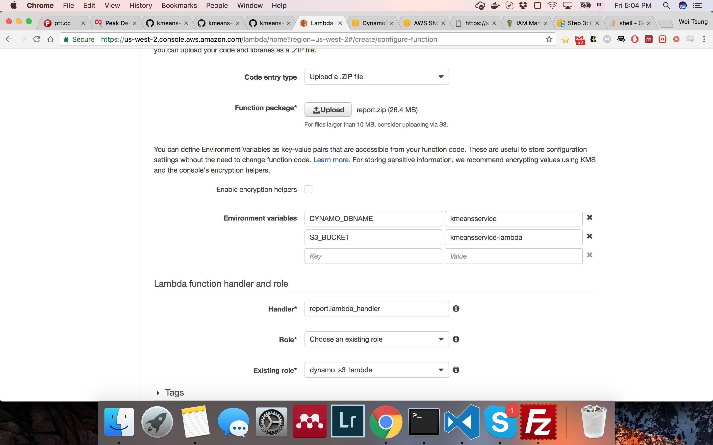
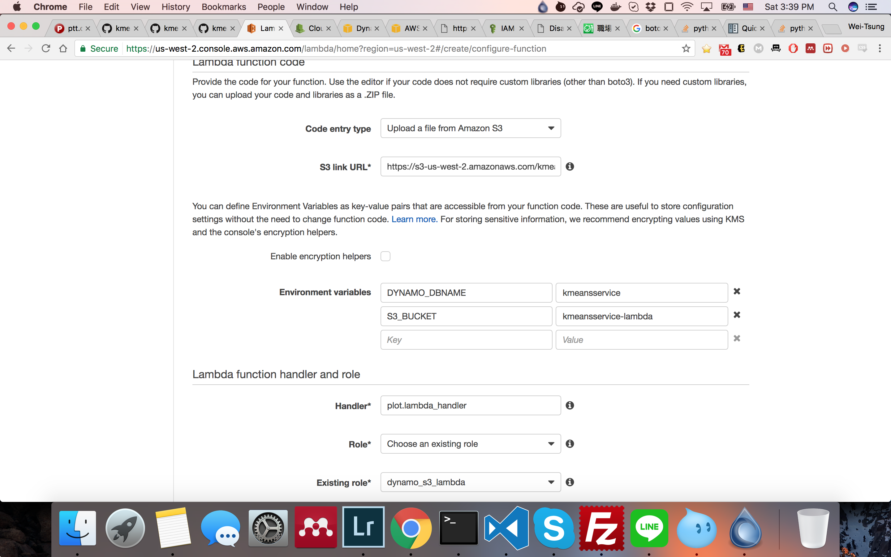
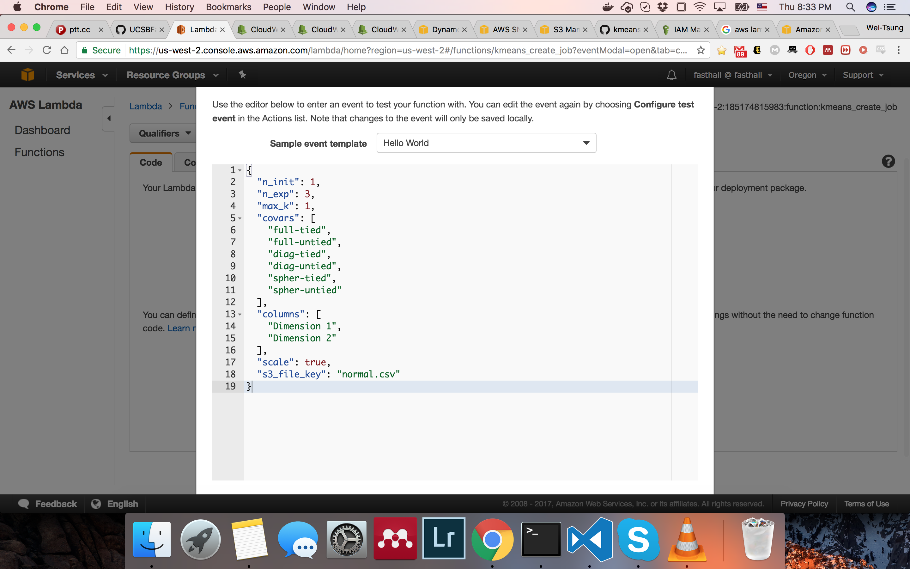
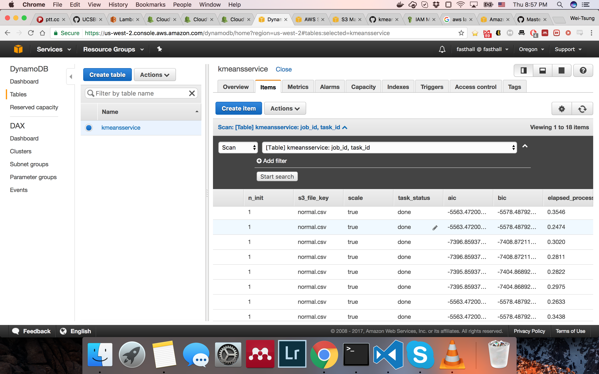

# Centaurus: K-Means as a Service
This is the AWS Lambda port of Centaurus.

Author: Angad Gill, Wei-Tsung Lin, Michael Zhang

## TODO
The libraries plot needs are too large and can't fit in a single zip file that AWS Lambda accepts.

## Deploy

### Build zip files

**DISCLAMIER** This application uses part of `sklearn`. Because putting all required libraries into zip file may exceed AWS Lambda's limit, so the necessary functions in sklearn is moved to sklearn_lite.py. The package is distributed under 3-Clause BSD license.

- Launch a t2.micro EC2 instance of `Amazon Linux AMI 2018.03.0 (HVM), SSD Volume Type - ami-a0cfeed8` (free-tier) on AWS to build zip file.
- Connect to EC2 instance and run 

```bash
$ sudo yum -y groupinstall "Development Tools"
$ git clone https://github.com/fasthall/kmeans-service.git
$ cd kmeans-service/site
$ sh build.sh
```
You will get 5 zip files: `create_job.zip`, `fetch_tasks.zip`, `worker.zip`, `record.zip`, `plot.zip`.

### Create S3 bucket


### Upload zip files to S3 bucket
- Upload 5 zip files and `normal.csv` to S3 bucket



### Create SNS topic


### Create DynamoDB table
**Use string 'job_id' as partition key and number 'task_id' as sort key.**


### Create Lambda function
Upload `create_job.zip` as source code.

* Runtime: Python 3.6
* Environment variables: {"DYNAMO_DBNAME": "*your dynamoDB table name*"}
* Handler: create_job.lambda_handler
* Role: A role can write to DynamoDB



Upload `fetch_task.zip` as source code.

* Runtime: Python 3.6
* Environment variables: {"SNS_TOPIC_ARN": "*your SNS topic arn*"}
* Handler: fetch_task.lambda_handler
* Role: A role can listen to DynamoDB Stream and publish to SNS topic
* **Add a trigger of DynamoDB** on `fetch_tasks`



Use `worker.zip` in S3 bucket as source code.

* S3 link URL: worker.zip's link in S3 bucket
* Runtime: Python 3.6
* Environment variables: {"DYNAMO_DBNAME": "*your dynamoDB table name*", "S3_BUCKET": "*your S3 bucket name*"}
* Handler: worker.lambda_handler
* Role: A role can listen to SNS topic and write to DynamoDB
* **Add a trigger of SNS** on `worker`
* Increase the timeout to 10 seconds to avoid lambda function not able to finish the task.



Upload `report.zip` as source code.

* Runtime: Python 3.6
* Environment variables: {"DYNAMO_DBNAME": "*your dynamoDB table name*", "S3_BUCKET": "*your S3 bucket name*"}
* Handler: report.lambda_handler
* Role: A role can listen to DynamoDB Stream and publish to SNS topic
* Increase the timeout to 10 seconds to avoid lambda function not able to finish the task.



Use `plot.zip` in S3 bucket as source code.

* S3 link URL: plot.zip's link in S3 bucket
* Runtime: Python 3.6
* Environment variables: {"DYNAMO_DBNAME": "*your dynamoDB table name*", "S3_BUCKET": "*your S3 bucket name*"}
* Handler: plot.lambda_handler
* Role: A role can read from S3 and write to DynamoDB
* Increase the timeout to 10 seconds to avoid lambda function not able to finish the task.



## Test

Test `create_job` function. use the following data as test data. Click `Test`.

    {
    "n_init": 1,
    "n_exp": 3,
    "max_k": 1,
    "covars": [
        "full-tied",
        "full-untied",
        "diag-tied",
        "diag-untied",
        "spher-tied",
        "spher-untied"
    ],
    "columns": [
        "Dimension 1",
        "Dimension 2"
    ],
    "scale": true,
    "s3_file_key": "normal.csv"
    }



You should see several items in DynamoDB table. the `task_status` will go from *pending* to *done*.

