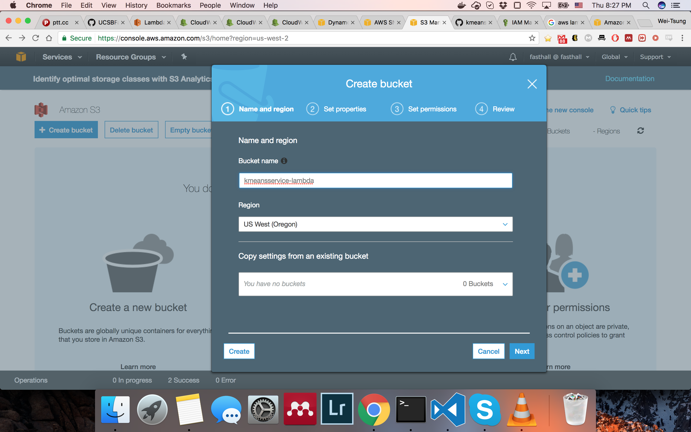

# Centaurus: K-Means as a Service
This is the AWS Lambda port of Centaurus.

Author: Angad Gill, Wei-Tsung Lin

## Deploy

### Build zip files
    $ sh build_zip.sh
You will get 3 zip files: `create_job.zip`, `fetch_tasks.zip`, and `worker.zip`.

### Create S3 bucket

### Upload worker.zip to S3 bucket

### Create SNS topic

### Create DynamoDB table
**Use string 'job_id' as partition key and number 'task_id' as sort key.**

### Create Lambda function
Upload `create_job.zip` as source code.

* Runtime: Python 3.6
* Environment variables: {"DYNAMO_DBNAME": "*your dynamoDB table name*"}
* Handler: create_job.lambda_handler
* Role: A role can write to DynamoDB

Upload `fetch_task.zip` as source code.

* Runtime: Python 3.6
* Environment variables: {"SNS_TOPIC_ARN": "*your SNS topic arn*"}
* Handler: fetch_task.lambda_handler
* Role: A role can listen to DynamoDB Stream and publish to SNS topic

Use `worker.zip` in S3 bucket as source code.

* S3 link URL: worker.zip's link in S3 bucket
* Runtime: Python 3.6
* Environment variables: {"DYNAMO_DBNAME": "*your dynamoDB table name*", "S3_BUCKET": "*your S3 bucket name*"}
* Handler: worker.lambda_handler
* Role: A role can listen to SNS topic and write to DynamoDB

Also, in advanced settings increase the timeout to avoid lambda function not able to finish the task.

## Test

Test `create_job` function. use the following data as test data. Click `Test`.

    {
    "n_init": 1,
    "n_exp": 3,
    "max_k": 1,
    "covars": [
        "full-tied",
        "full-untied",
        "diag-tied",
        "diag-untied",
        "spher-tied",
        "spher-untied"
    ],
    "columns": [
        "Dimension 1",
        "Dimension 2"
    ],
    "scale": true,
    "s3_file_key": "normal.csv"
    }

You should see several items in DynamoDB table. the `task_status` will go from *pending* to *done*.

